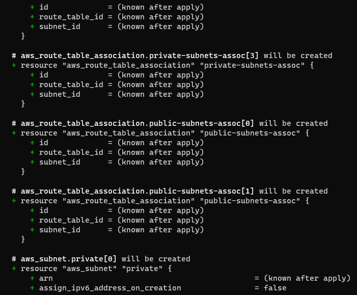

# Doocumentation of Project 17

1. I continued from where I stopped at project 16 by creating private subnets
   
   

2. I added tags to my private and public subnets

   

3. I added the variable for my private subnet and tags in my 'variable.tf' file

   
   
   

4. I ran the `terraform plan` command and it was successful
    
    
    
    
    
    
    

5. I created two new files namely 'internet-gateway.tf' and 'nat-gateway.tf' and I inserted the required commands for me to create internet gateway, nat gateway and elastic ip address

    
    
    

6. I ran the `terraform plan` command as usual and it worked

    
    
    
    
    
    
    

7. I created another file; 'routes.tf' and inserted the required commands for creating route table, routes and route-table association. Then I ran the `terraform plan` command and it worked.

    
    
    
    
    
    

8. I ran the `terraform apply` command and it worked
   
   
   

9. I confirmed everything that was created on my aws console
   
   
   
   
   
   
   
   
   

10. I created three files;

a. "cert.tf"- for creating and validating a certificate and for also creating records in Route53 on aws console

b. "security.tf"- for creating security groups and editing the rules

c. "alb.tf"- for creating load balancers, target groups

   
   
   

11. I ran the `terrraform plan` and `terraform apply` commands and it worked
    
    

12. I confirmed the things I just created on my aws console

    
    
    
    
    

13. I created another file; "routes.tf" for creating Iam role policy. Then I  ran `terraform plan` command as usual
    
    
    

14. I created new files;

a. "asg-webserver.tf"- for creating launch templates
  
b. "asg-bastion.tf"- for creating auto-scaling groups

c. "bastion.sh"- a shell script for bastion

d. "nginx.sh"- a shell script for nginx

e. "tooling.sh"- a shell script for tooling

f. "wordpress.sh"- a shell script for wordpress

g. "outputs.tf"- for the output

then I ran `terraform plan` and `terraform apply` and it worked

     
     
     
     
     
     
     
     

15. I checked my aws console to confirm if what I created is showing

     

16. I created new files;

a. "efs.tf"- for creating a file system and a key

b. "rds.tf"- for creating a subnet group and a database

Then I applied the code and it worked
    

    
    
    

17. I confirmed what I've created on my aws console

    
    
    
    
    
    
    